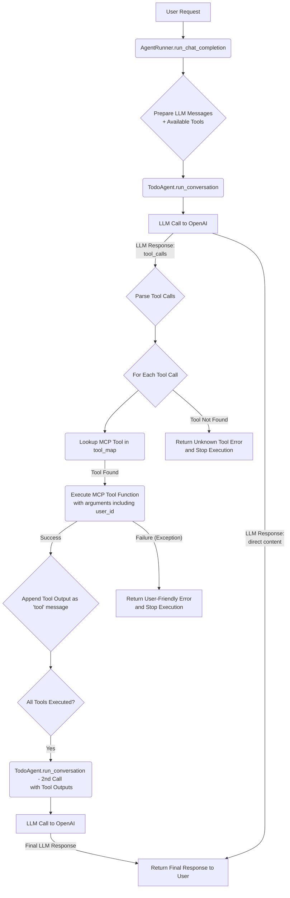

# `agent_runner.md` - Agent Execution and Tool Orchestration Specification

## 1. Purpose of the Component
The `agent_runner.py` component is responsible for orchestrating the overall execution flow of the Todo AI Chatbot. It acts as the central hub that manages interactions between the user, the `TodoAgent` (which handles LLM communication), and the various MCP (Micro-service Control Plane) tools. Its primary purpose is to ensure that user requests are correctly processed, tool calls are executed, and appropriate responses are delivered, while maintaining a stateless interaction model.

## 2. Architecture Role
**Role:** Execution Orchestrator and Tool Dispatcher.
The `AgentRunner` sits between the external communication layer (where user input is received) and the `TodoAgent`. It is responsible for:
-   Initializing the `TodoAgent` with the necessary OpenAI client and tool definitions.
-   Managing the conversational turn, including passing user messages to the `TodoAgent` and receiving responses.
-   Detecting and executing tool calls suggested by the `TodoAgent`.
-   Feeding tool outputs back into the conversation for the LLM to process further.
-   Handling exceptions during tool execution.

## 3. Responsibilities
-   **Initialization:** Sets up the OpenAI client and maps MCP tool functions to their callable implementations.
-   **`TodoAgent` Instantiation:** Creates an instance of the `TodoAgent`, providing it with the necessary client and tool definitions.
-   **Conversation Flow Management:** Manages the sequence of messages exchanged with the LLM for a single user request, ensuring the system prompt, user message, and tool outputs are correctly structured.
-   **Tool Definition Formatting:** Converts raw MCP tool functions into `FunctionTool` objects with their corresponding schemas, which are then exposed to the `TodoAgent` (and consequently, the OpenAI LLM).
-   **Tool Call Execution:** When the LLM (via `TodoAgent`) suggests a tool call, the `AgentRunner` is responsible for parsing the suggested call and invoking the actual MCP function with the extracted arguments.
-   **Output Integration:** Incorporates the results (or errors) of tool executions back into the message history, allowing the LLM to generate a final, informed response.
-   **Error Handling:** Catches and manages exceptions that occur during the execution of MCP tool functions.

## 4. Decision Logic
The decision logic within `AgentRunner` is primarily procedural and focused on execution flow:
-   **Tool Call Detection:** It checks the LLM's response for `tool_calls`. If present, it proceeds to the tool execution phase.
-   **Tool Mapping:** It maps the `function_name` from the LLM's `tool_call` to the actual Python callable function in its `tool_map`.
-   **Parameter Handling:** It deserializes the JSON arguments provided by the LLM and passes them to the identified MCP tool function, ensuring the `user_id` is always included.
-   **Re-prompting LLM:** After tool execution, it determines if the LLM needs to be re-prompted with the tool's output to generate a final user-facing response.

## 5. MCP Tool Interaction Flow
1.  **Tool Map Creation:** At initialization, `AgentRunner` creates a `tool_map` (a dictionary) linking string names of MCP tools (e.g., "add_task") to their actual Python function implementations (e.g., `dummy_add_task`).
2.  **Schema Generation:** The `_get_function_tools` method dynamically generates OpenAI `FunctionTool` schemas for each MCP tool. This ensures the LLM understands the tool's purpose and expected parameters.
3.  **LLM Invocation:** `AgentRunner` calls `TodoAgent.run_conversation`, which in turn queries the OpenAI LLM, providing it with the user message and the formatted `FunctionTool` schemas.
4.  **Tool Call Parsing:** Upon receiving a response from the LLM, `AgentRunner` inspects `response_message.tool_calls`.
5.  **Execution:** For each `tool_call`, `AgentRunner` retrieves the corresponding function from its `tool_map`, parses the arguments, and executes the function (e.g., `await function_to_call(**function_args)`).
6.  **Feedback to LLM:** The output (or error) from the MCP tool execution is formatted as a "tool" message and appended to the conversation history. This updated history is then sent back to the LLM for a second round of processing, allowing it to incorporate the tool's result into its final user-facing response.

## 6. Stateless Behavior Explanation
-   The `AgentRunner` ensures statelessness by passing all necessary context (i.e., the `messages` list) explicitly for each `run_chat_completion` call.
-   The `self.messages` attribute is reset or explicitly managed for each turn, preventing unintended accumulation of state across independent user requests.
-   `user_id` is passed with every tool call, isolating operations to the specific user and preventing cross-user state leakage.
-   MCP tools themselves are expected to be stateless, processing inputs and returning outputs without relying on or modifying session-specific data.

## 7. Error Handling Strategy
-   **Tool Execution Errors:** The `AgentRunner` wraps MCP tool calls in `try-except` blocks. If an exception occurs during tool execution:
    -   An `error_message` is constructed.
    -   This error message is formatted as a "tool" message and appended to the `messages` history.
    -   The `AgentRunner` immediately returns a user-friendly error message, informing the user about the failure and preventing further unnecessary LLM calls.
-   **Unknown Tool Errors:** If the LLM attempts to call a tool not present in the `tool_map`, `AgentRunner` identifies this as an error and returns an appropriate message to the user.
-   **Stateless Reporting:** Error messages are transient and communicated directly to the user for the current interaction. No error state is persisted internally by the `AgentRunner`.

## 8. Production Design Explanation
-   **Decoupling:** `AgentRunner` decouples the core LLM interaction logic (`TodoAgent`) from the actual tool execution. This allows for easier testing, maintenance, and potential swapping of LLM agents or tool implementations.
-   **Centralized Tool Management:** The `tool_map` provides a single, clear point for defining and managing all available MCP tools, enhancing maintainability.
-   **Robustness:** Explicit error handling during tool execution prevents unhandled exceptions from crashing the system and provides informative feedback to the user.
-   **Extensibility:** New MCP tools can be easily integrated by adding them to the `tool_map` and defining their `FunctionTool` schema in `_get_function_tools`.
-   **Scalability:** Like `TodoAgent`, `AgentRunner`'s stateless nature contributes to the overall scalability of the system, allowing multiple instances to handle concurrent requests without shared state issues.

## 9. Execution Flow Diagrams (Text-Based)

## 10. Example Conversation → Tool Mapping

This component orchestrates the execution *after* the LLM (via `TodoAgent`) has proposed a tool call.

| LLM Suggested Tool Call (`function_name`, `arguments`)             | Action by `AgentRunner`                                                      | Tool Function Executed (MCP)             | Result of Action                                            | Subsequent LLM Input/Output (if re-prompted)                               |
| :----------------------------------------------------------------- | :--------------------------------------------------------------------------- | :--------------------------------------- | :---------------------------------------------------------- | :----------------------------------------------------------------------- |
| `add_task`, `{"user_id": "u1", "title": "Buy milk"}`              | Calls `tool_map["add_task"](user_id="u1", title="Buy milk")`                | `async def add_task(...)`                | `{"status": "success", "message": "Task 'Buy milk' added."}` | LLM receives `{"role": "tool", "content": ...}` then generates: "✅ Your task 'Buy milk' has been added." |
| `list_tasks`, `{"user_id": "u1", "status": "pending"}`            | Calls `tool_map["list_tasks"](user_id="u1", status="pending")`              | `async def list_tasks(...)`              | `{"status": "success", "tasks": [{"id": "t1", ...}]}`     | LLM receives `{"role": "tool", "content": ...}` then generates: "Here are your pending tasks: [Task details]." |
| `complete_task`, `{"user_id": "u1", "task_id": "t123"}`           | Calls `tool_map["complete_task"](user_id="u1", task_id="t123")`             | `async def complete_task(...)`           | `{"status": "success", "message": "Task t123 completed."}` | LLM receives `{"role": "tool", "content": ...}` then generates: "✅ Task 't123' has been marked as completed." |
| `delete_task`, `{"user_id": "u1", "task_id": "nonexistent"}`      | Calls `tool_map["delete_task"](user_id="u1", task_id="nonexistent")`        | `async def delete_task(...)`             | `{"status": "error", "message": "Task not found."}`        | LLM receives `{"role": "tool", "content": ...}` then generates: "❌ I couldn't find a task with ID 'nonexistent'. Please check the ID and try again." |
| `malicious_tool`, `{"user_id": "u1", "payload": "..."}`           | Attempts lookup in `tool_map`, finds no entry.                             | (None - `KeyError`)                      | `f"❌ Error: Agent tried to call an unknown tool: malicious_tool"` | (Returns error directly to user, no re-prompt to LLM.)           |
