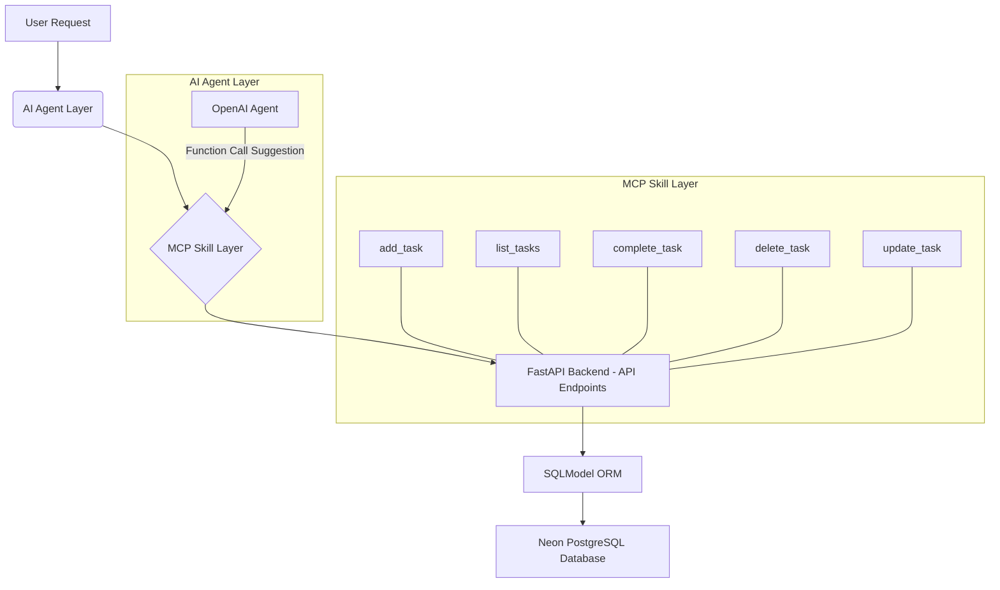

# `skill_architecture.md` - MCP Skill Layer Architecture Specification

## Skill Layer Design

The MCP Skill Layer for the Todo AI Chatbot is designed to provide a modular, secure, and extensible set of capabilities that the AI agents can invoke. It acts as the interface between the natural language processing layer (AI Agents) and the underlying business logic and data persistence (FastAPI Backend, SQLModel, Neon PostgreSQL).

**Key Principles:**
1.  **Atomicity**: Each skill (`add_task`, `list_tasks`, etc.) represents a single, well-defined, and atomic operation.
2.  **Statelessness**: Skills do not maintain internal state. All necessary context is passed with each invocation.
3.  **User Isolation**: Every skill invocation requires a `user_id` to ensure operations are scoped to the correct user.
4.  **Schema-Driven**: Each skill defines clear input and output JSON schemas, facilitating AI agent integration and validation.
5.  **Robust Error Handling**: Skills are designed to catch and report errors gracefully through their output schemas.
6.  **Technology Agnostic Interface**: The skill interface (input/output schemas) is decoupled from the underlying implementation technologies (e.g., SQLModel).

**Layered Architecture:**

**Components of a Skill:**
Each skill (e.g., `add_task`) is conceptually defined by:
-   **Name**: Unique identifier.
-   **Purpose**: Clear, single objective.
-   **Input Schema**: Defines expected parameters and their types, including `user_id`.
-   **Output Schema**: Defines the structure of the successful response and error responses.
-   **Validation Rules**: Business logic constraints on input.
-   **Error Handling**: Defined responses for various failure modes.
-   **Security**: Explicit rules for `user_id` isolation.
-   **Stateless Execution**: Guarantee of no retained state.

## Tool Router Strategy

The Tool Router Strategy dictates how an AI agent, upon identifying an intent, selects and dispatches to the correct MCP skill.

**Primary Strategy: OpenAI Function Calling**
The core strategy relies on OpenAI's advanced function calling capabilities.
1.  **Schema Exposure**: All defined MCP skills (e.g., `add_task`, `list_tasks`) are presented to the OpenAI agent (via `TodoAgent` and `AgentRunner`) as structured `FunctionTool` objects, including their names, descriptions, and input JSON schemas.
2.  **LLM Intent Mapping**: The OpenAI LLM analyzes the user's natural language request alongside the exposed tool schemas.
3.  **Optimal Tool Selection**: The LLM autonomously determines the most appropriate tool(s) to call and extracts the necessary arguments directly from the user's prompt.
4.  **Argument Generation**: The LLM generates the arguments for the selected tool(s) in JSON format, adhering to the tool's input schema.
5.  **AgentRunner Dispatch**: The `AgentRunner` receives the LLM's `tool_calls` suggestion and dispatches the request to the corresponding backend MCP tool implementation.

**Fallback/Guidance Strategy (Conceptual via `ToolDecisionEngine`):**
In scenarios where LLM function calling might be ambiguous or for explicit control/debugging, a `ToolDecisionEngine` could employ a rule-based approach:
-   **Keyword Matching**: Identify primary verbs and nouns in the user input (e.g., "add", "list", "complete", "task").
-   **Parameter Inference**: Extract specific entities (e.g., task title, ID, date) using natural language parsing or regex.
-   **Confidence Scoring**: Assign a confidence score to potential tool matches.
-   **Clarification**: If confidence is low or required parameters are missing, the agent initiates a clarification dialogue with the user.

## Tool Composition Strategy

Tool composition refers to the ability to handle complex user requests that may require invoking multiple skills in a coordinated manner.

**Strategy: Multi-Turn Orchestration via LLM and AgentRunner**

The primary strategy for tool composition is driven by the LLM's ability to engage in multi-turn reasoning and the `AgentRunner`'s capability to execute tool calls and feed results back to the LLM.

1.  **Sequential Execution**:
    -   **LLM Initiates First Tool**: The LLM identifies the first necessary skill (e.g., `list_tasks`) and its parameters.
    -   **AgentRunner Executes**: The `AgentRunner` executes the tool and captures its output.
    -   **Feedback Loop**: The tool's output is returned to the LLM (as a special `tool` role message in the conversation history).
    -   **LLM Decides Next Step**: Based on the *output* of the first tool, the LLM then decides the next logical action. This might be:
        -   Invoking a second tool (e.g., `complete_task` on one of the listed tasks).
        -   Asking the user for clarification.
        -   Providing a final response to the user.
    -   **Example**: "Show me my pending tasks, then complete the one about buying groceries."
        -   LLM calls `list_tasks`.
        -   `AgentRunner` executes `list_tasks`, gets results.
        -   `AgentRunner` sends results back to LLM.
        -   LLM analyzes results, identifies "buying groceries" task ID, then calls `complete_task` with that ID.

2.  **Parallel Execution (Conceptual):**
    -   If a user requests multiple *independent* actions, the LLM *could* theoretically suggest multiple tool calls simultaneously within a single response.
    -   The `AgentRunner` would then execute these tool calls concurrently (if the underlying MCP supports it) or in a defined sequence.
    -   **Example**: "Add a task to call John and another to send an email to Mary."
        -   LLM could suggest `add_task("call John")` and `add_task("send email to Mary")` in one `tool_calls` array.
        -   `AgentRunner` executes both, potentially in parallel.

3.  **Human-in-the-Loop Clarification**:
    -   For complex or ambiguous compositional requests, the LLM is instructed (via the `agent_instructions.py` system prompt) to ask for clarification from the user rather than making assumptions. This ensures accuracy and user control.

4.  **Error Propagation**:
    -   If any step in a multi-step composition fails (e.g., an MCP tool returns an error), the `AgentRunner` captures this error.
    -   The error is reported back to the LLM.
    -   The LLM's responsibility is then to halt the composition, inform the user of the specific failure in a user-friendly manner, and suggest corrective actions, adhering to its error handling strategy.
